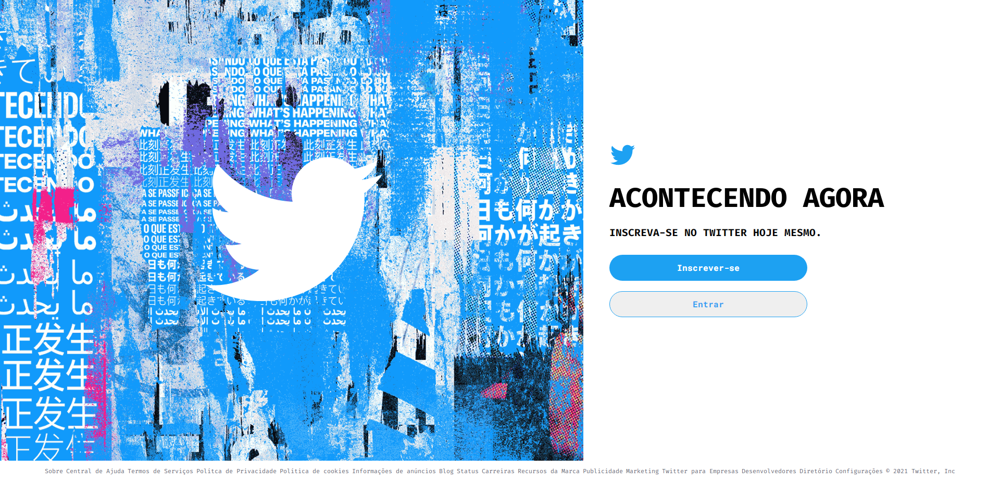
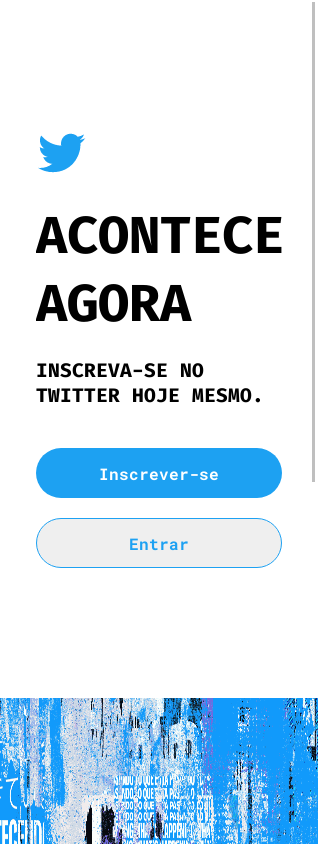

# Clone-Twitter-React

Clone da homepage do Twiter.

 

## SUMÁRIO

- Status
- Deploy
- Features
- Demonstração da Aplicação
- Como Rodar a Aplicação
- Pré Requisitos Para Rodar a Aplicação
- Tecnologias utilizadas
- Autor

## Status

✨Concluído ✨

## Deploy

- [https://vitor-mat.github.io/Clone-Twitter-React/](https://vitor-mat.github.io/Clone-Twitter-React/)

## Features

- Site responsivo

## Demonstração da Aplicação

### Clone Twitter Desktop

### Clone Twitter Mobile 1

### Clone Twitter Mobile 2

## Pré Requisitos Para Rodar a Aplicação

- Instalar o Node Js.

## Como Rodar a Aplicação

Pelo promt de comando entre na pasta do projeto, em seguida rode o comando npm install (para instalar as dependências), e por fim, rode o comando npm start (para que o projeto seja iniciado no navegador).

## Tecnologias Utilizadas

- [React_Js](https://pt-br.reactjs.org/docs/getting-started.html)
- [styled-components](https://styled-components.com/docs)

## Autor

Feito por Vitor Mateus

 
